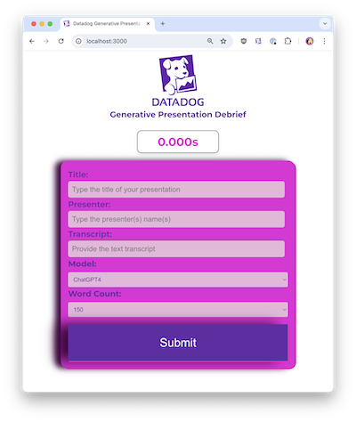

# Datadog Generative Debriefing Doc Generator
Demo to show off generative AI creation with a Logic App along with Monitoring on Datadog

[View live Demo](https://purple-desert-0fca51310.3.azurestaticapps.net)

## What is this?
This is a basic React app to display a form for users to submit details about a recent presentation which is then sent to an Azure Logic App.

From there, the Logic App processes the submission and sends prompts to ChatGPT to generate a new response which is then displayed to the user.

## Resources

- [Azure OpenAI Integration Docs](https://docs.datadoghq.com/integrations/azure_openai/)
- [OpenAI Integration](https://docs.datadoghq.com/integrations/openai)
- [OpenAI Integration Blog](https://www.datadoghq.com/blog/monitor-openai-with-datadog/)
- [OpenAI Monitoring](https://www.datadoghq.com/solutions/openai/)
- [Azure Integration](https://www.datadoghq.com/solutions/azure/)
- [Logic App Integration Docs](https://docs.datadoghq.com/integrations/azure_logic_app)
- [Logic App Integration Blog](https://www.datadoghq.com/blog/monitor-azure-logic-app-workflows-datadog/)
- [RUM Documentation](https://docs.datadoghq.com/real_user_monitoring/)
- [Real User Monitoring](https://docs.datadoghq.com/real_user_monitoring/)

